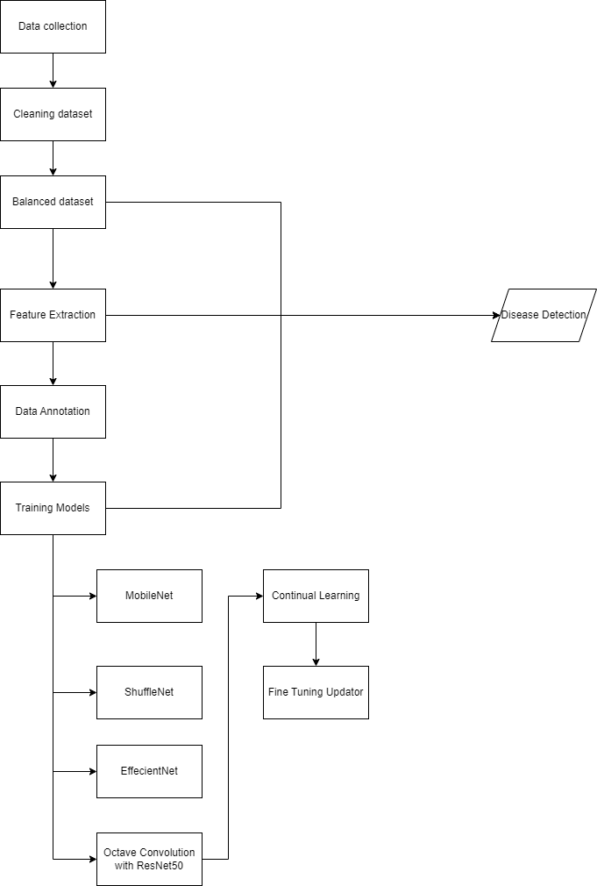

# 🌱 CropGuard AI
### Continual Learning Framework for Intelligent Crop Disease Classification

<p align="center">
  
</p>

## 📖 Overview

CropGuard AI is an intelligent crop disease classification framework that combines **Deep Learning**, **Transfer Learning**, and **Continual Learning** to build a scalable agricultural disease detection system.

Traditional image classification models require complete retraining whenever new disease classes are introduced. This process is computationally expensive and often leads to **catastrophic forgetting**, where the model loses knowledge of previously learned classes.

CropGuard AI addresses this challenge by integrating **Amazon Renate's Continual Learning framework** with **Teacher-Student Knowledge Distillation**, allowing the model to incrementally learn new crop diseases while preserving previously acquired knowledge.

The project explores multiple modern CNN architectures and compares their effectiveness for agricultural disease classification.

---

# 🎯 Problem Statement

Crop diseases significantly impact agricultural productivity worldwide. Early and accurate disease detection enables timely intervention, reducing crop losses and improving food security.

Most existing deep learning solutions suffer from several limitations:

- Models must be retrained from scratch whenever new diseases appear.
- Retraining requires access to all historical datasets.
- Computational cost increases rapidly.
- Previously learned knowledge may be lost (Catastrophic Forgetting).

CropGuard AI was designed to overcome these challenges through continual learning, enabling incremental updates without rebuilding the entire model.

---

# ✨ Key Features

- 🌿 Crop Disease Classification
- 🧠 Continual Learning using Amazon Renate
- 📚 Teacher–Student Knowledge Distillation
- 🔄 Incremental Learning Pipeline
- 🚀 Transfer Learning
- 📈 99.7% Classification Accuracy
- 🖼️ Image Preprocessing & Augmentation
- 📊 Multiple CNN Architecture Comparison
- 🌾 Scalable framework for future disease expansion

---

# 🏗️ System Workflow

```
Crop Images
     │
     ▼
Image Preprocessing
     │
     ▼
Data Augmentation
     │
     ▼
Transfer Learning
     │
     ▼
Teacher Model
     │
Knowledge Distillation
     ▼
Student Model
     │
     ▼
Renate Continual Learning
     │
     ▼
Disease Classification
```

---

# 🧠 Why Continual Learning?

Traditional Deep Learning Workflow

```
New Disease
      │
      ▼
Retrain Entire Model ❌
```

CropGuard AI Workflow

```
New Disease
      │
      ▼
Incremental Learning ✅
      │
      ▼
Previous Knowledge Preserved
```

Continual learning significantly reduces computational overhead while enabling scalable deployment in real-world agricultural environments.

---

# 🧪 Implemented Models

This repository contains implementations and experiments using multiple convolutional neural network architectures.

| Model | Purpose |
|--------|----------|
| Octave ResNet-50 | Primary research architecture |
| EfficientNet | Lightweight high-performance model |
| MobileNet | Edge deployment |
| ShuffleNet | Computational efficiency |
| DenseNet | Feature reuse and deep connectivity |
| GoogLeNet | Multi-scale feature extraction |
| ResNet18 | Residual learning baseline |
| AlexNet | Classical benchmark |

The primary implementation focuses on **Octave ResNet-50** combined with continual learning techniques.

---

# 🏛️ Repository Structure

```
CropGuard-AI/
│
├── Workflow.png
│
├── Final Codes/
│   ├── Octave ResNet-50
│   ├── EfficientNet
│   ├── MobileNet
│   ├── ShuffleNet
│   ├── GoogLeNet
│   ├── DenseNet
│   ├── AlexNet
│   └── ResNet18
│
├── Continual Learning/
│   ├── Renate Framework
│   ├── Fine Tuning
│   ├── Model Updaters
│   └── Teacher-Student Training
│
└── README.md
```

---

# ⚙️ Technologies Used

## Programming

- Python

## Deep Learning

- TensorFlow
- Keras
- OpenCV
- NumPy
- Scikit-Learn

## Continual Learning

- Amazon Renate
- Teacher–Student Knowledge Distillation

## Computer Vision

- Image Processing
- Transfer Learning
- Data Augmentation

---

# 📂 Dataset

The model was trained using labeled crop leaf images representing multiple disease categories.

The preprocessing pipeline includes:

- Image resizing
- Normalization
- Data augmentation
- Dataset balancing
- Train-validation splitting

These preprocessing techniques improve generalization while reducing overfitting.

---

# ⚙️ Training Pipeline

1. Load and preprocess crop images.
2. Apply augmentation techniques.
3. Train the Teacher model.
4. Distill knowledge into the Student model.
5. Integrate Amazon Renate continual learning.
6. Incrementally introduce new disease classes.
7. Evaluate classification performance.

---

# 📈 Results

| Metric | Result |
|---------|-------:|
| Classification Accuracy | **99.7%** |
| Learning Strategy | Continual Learning |
| Transfer Learning | ✅ |
| Knowledge Distillation | ✅ |
| Catastrophic Forgeting Reduction | ✅ |

The proposed framework demonstrates that continual learning enables incremental model updates while maintaining high classification performance and minimizing computational cost.

---

# 💡 Engineering Challenges

During development, several practical machine learning challenges were addressed:

- Designing an incremental learning pipeline.
- Reducing catastrophic forgetting.
- Integrating Amazon Renate into the training workflow.
- Comparing multiple CNN architectures.
- Selecting an optimal transfer learning backbone.
- Balancing computational efficiency and prediction accuracy.
- Managing knowledge transfer between Teacher and Student models.

---

# 🚀 Future Improvements

- 📱 Android Application
- ☁️ Cloud Deployment
- 🌐 REST API for inference
- 🚁 Drone-based disease monitoring
- 🌾 Multi-crop support
- 🔍 Explainable AI using Grad-CAM
- 📡 IoT integration for smart farming
- 🤖 Edge AI deployment using TinyML
- 🌍 Multi-language farmer interface
- 📈 Active Learning for automatic dataset expansion

---

# 📄 Research Significance

CropGuard AI demonstrates how continual learning can improve the adaptability of agricultural AI systems.

Instead of rebuilding models whenever new diseases emerge, the proposed framework enables efficient incremental learning while preserving existing knowledge.

The project combines:

- Deep Learning
- Transfer Learning
- Continual Learning
- Knowledge Distillation

to create a scalable, research-oriented disease classification system suitable for future intelligent farming applications.

---

# 📌 Project Highlights

✅ 99.7% Classification Accuracy

✅ Amazon Renate Continual Learning

✅ Teacher–Student Knowledge Distillation

✅ Transfer Learning Pipeline

✅ Multiple CNN Architecture Evaluation

✅ Reduced Catastrophic Forgetting

✅ Research-Oriented Implementation

---

# 🔮 Potential Applications

- Precision Agriculture
- Smart Farming
- Agricultural Advisory Systems
- Drone-based Crop Monitoring
- Edge AI Disease Detection
- Automated Crop Health Analysis
- Agricultural Research

---

# 🤝 Contributing

Contributions, suggestions, and improvements are welcome.

If you would like to improve the project, feel free to fork the repository and submit a pull request.

---

# 👨‍💻 Author

**Pulipaka Sudarshan Pavan Kumar**

Computer Vision • Machine Learning • Embedded AI • Intelligent Systems

- GitHub: https://github.com/Sudarshan-Pavan
- LinkedIn: *(Add your LinkedIn URL here)*

---

## ⭐ If you found this project useful, consider giving it a star!
